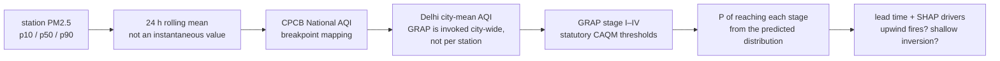
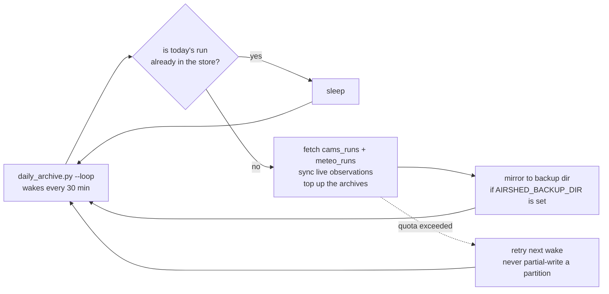

# Airshed — end-to-end process flow

Every stage of the system, in the order it actually runs, with the module that
does it, the file it writes and the rule it exists to enforce. Diagrams render
on GitHub.

The shape of it in one line:

> **five free sources → one local cache → one aligned hourly table → a correction
> learned on top of CAMS → an evaluation that has to beat persistence → a GRAP
> probability with 72 hours of lead.**

There are two paths through the system and they must be kept apart in your head:

| | runs when | reads | produces |
|---|---|---|---|
| **Training path** | offline, on demand | the whole archive | a fitted, calibrated model + a results table |
| **Serving path** | every request | the cache only, never the network | a 72 h forecast, GRAP probabilities, drivers, a surface |

They share one thing on purpose — the same feature builder — because the moment
training and serving construct their inputs differently, the measured skill stops
being real.

---

## The master flow

```mermaid
flowchart TD

  subgraph L1["1 · SOURCES — free, external"]
    direction LR
    CAMS["<b>CAMS PM2.5 + gases + AOD</b><br/>Open-Meteo Air Quality<br/>no key · ~40 km · out to 7 days<br/><i>supplies the future</i>"]
    MET["<b>GFS meteorology</b><br/>wind, boundary layer, humidity<br/>Historical Forecast + Previous Runs<br/><i>archived forecasts, never ERA5 — R1</i>"]
    CPCB["<b>CPCB CAAQMS PM2.5</b><br/>via OpenAQ v3<br/>77 NCR + 24 upwind stations<br/><i>ground truth</i>"]
    FIRE["<b>NASA FIRMS fires</b><br/>VIIRS / MODIS · Punjab + Haryana"]
    VIS["<b>METAR visibility</b><br/>IEM ASOS archive at VIDP"]
  end

  subgraph L2["2 · INGEST"]
    direction TB
    ING["<b>ingest/</b> cams · meteo · cpcb<br/>fires · metar<br/>fetch start, end → DataFrame<br/><i>the only code that may<br/>touch the network</i>"]
    RES["<b>station resolution</b><br/>ids + coordinates<br/>step-change check — R6"]
    RES --> ING
  end

  STORE[("<b>3 · PARQUET STORE</b> — R8<br/>data/raw/dataset/date=.../part.parquet<br/>9.1 M rows · DuckDB<br/>re-fetch replaces one file")]

  subgraph OPS["OPERATIONS · resident"]
    direction TB
    JOB["<b>daily_archive.py --loop</b><br/>every 30 min: is today's<br/>run in the store?"]
    RUNS["<b>cams_runs + meteo_runs</b><br/>by ISSUE date<br/><i>cannot be backfilled</i>"]
    JOB --> RUNS
  end

  subgraph L4["4 · FEATURES · features/build.py"]
    direction TB
    IDX["<b>complete hourly index</b><br/>station × hour, UTC<br/><i>built before any lag</i>"]
    JOIN["<b>align every source</b><br/>observations at ≤ issue_time<br/>forecasts at target_time"]
    DER["<b>derive</b><br/>lags 1–72 h · rolling 3/24/72 h<br/>ventilation · inversion · lapse<br/>upwind PM2.5 · transport h · fires"]
    LEAD["<b>lead-match meteorology</b><br/>the forecast really in hand<br/>horizon_h earlier"]
    SUP["<b>supervised table</b><br/>station × issue_time × horizon<br/><i>direct heads, no rollout — R4</i>"]
    SPLIT["<b>split by time block</b><br/>whole episodes + 96 h embargo<br/><i>never at random — R3</i>"]
    IDX --> JOIN --> DER --> LEAD --> SUP --> SPLIT
  end

  subgraph L5["5 · MODELS"]
    direction TB
    BASE["<b>baselines, written first</b><br/>persistence · raw CAMS — R2"]
    CORR["<b>corrector — LightGBM</b><br/>target = observed − CAMS<br/>3 horizons × 3 quantiles<br/><i>failure decays to raw CAMS</i>"]
    CAL["<b>conformal calibration</b><br/>54% → 85.1% coverage"]
    GRAPH["<b>wind-aware graph → surface</b><br/>0.05° grid + distance to monitor — R7"]
    CORR --> CAL --> GRAPH
  end

  subgraph L6["6 · EVALUATION"]
    direction TB
    ABL["<b>ablation</b> — RMSE by horizon,<br/>skill, bias, episode recall, regime"]
    ROLL["<b>rolling</b> — 5 seasonal folds, paired"]
    GRAPEV["<b>grap</b> — per-class recall + lead<br/><i>never overall accuracy — R5</i>"]
    LOSO["<b>loso</b> — leave-one-station-out"]
    SIDE["<b>leadmatch · coupling · camsoffset</b>"]
    ABL --> ROLL --> GRAPEV --> LOSO --> SIDE
  end

  GATE{"<b>beats persistence AND raw CAMS</b><br/>on every fold, by more than<br/>the spread of that margin?"}
  NEG["<b>negative result, published</b><br/>fires +0.9% · corridor +0.0%<br/>coupling −0.1%<br/><i>each inside its own scatter</i>"]
  MODEL[("<b>calibrated model</b><br/>forecast_model.pkl")]

  subgraph L7["7 · SERVE · cache only"]
    direction TB
    LIVEF["<b>live features</b> from cache"]
    PRED["<b>predict</b> p10 / p50 / p90<br/>24 / 48 / 72 h, per station"]
    GRAPM["<b>GRAP</b><br/>24 h mean → CPCB AQI →<br/>Delhi city mean → stage<br/>→ P of reaching each stage"]
    ATTR["<b>attribution</b><br/>exact tree SHAP, grouped<br/>into human causes"]
    SURF["<b>surface</b> 0.05° grid"]
    API["<b>FastAPI</b><br/>/forecast /replay /grap<br/>/surface /status"]
    LIVEF --> PRED --> GRAPM --> ATTR --> SURF --> API
  end

  UI["<b>8 · DASHBOARD</b><br/>MapLibre + deck.gl<br/>72 h table with intervals<br/>GRAP probability bars<br/>held-out replay · drivers<br/>last-synced age that reddens"]

  DEC(["<b>THE DECISION</b><br/>CAQM / DPCC · 72 h of lead<br/>invoke or hold each GRAP stage<br/>schools · construction · traffic · IGI fog"])

  START(["<b>START</b><br/>airshed ingest all"])

  START --> ING
  CAMS --> ING
  MET --> ING
  CPCB --> ING
  FIRE --> ING
  VIS --> ING
  ING --> STORE
  RUNS --> STORE
  STORE --> IDX
  SPLIT --> BASE
  SPLIT --> CORR
  BASE --> ABL
  GRAPH --> ABL
  SIDE --> GATE
  GATE -->|"no"| NEG
  NEG -.->|"more seasons,<br/>not more features"| SPLIT
  GATE -->|"yes"| MODEL
  MODEL --> PRED
  STORE --> LIVEF
  API --> UI --> DEC

  classDef src fill:#eef3f9,stroke:#a9bcd0,color:#1f3a5f;
  classDef proc fill:#ffffff,stroke:#2f6fb2,color:#1f3a5f;
  classDef hero fill:#1f3a5f,stroke:#1f3a5f,color:#ffffff;
  classDef out fill:#e3f1ec,stroke:#1e7a66,color:#14503f;
  classDef warn fill:#fdf1df,stroke:#b26a00,color:#8a5200;
  class CAMS,MET,CPCB,FIRE,VIS src;
  class ING,RES,IDX,JOIN,DER,LEAD,SUP,SPLIT,ABL,ROLL,GRAPEV,LOSO,SIDE,LIVEF,PRED,SURF,API,JOB,RUNS proc;
  class STORE,MODEL,CORR,START,DEC hero;
  class BASE,CAL,GRAPH,GRAPM,ATTR,UI out;
  class NEG,GATE warn;

  style L1 fill:#f6f9fc,stroke:#c9d6e3,color:#1f3a5f;
  style L2 fill:#f6f9fc,stroke:#c9d6e3,color:#1f3a5f;
  style L4 fill:#f6f9fc,stroke:#c9d6e3,color:#1f3a5f;
  style L5 fill:#f6f9fc,stroke:#c9d6e3,color:#1f3a5f;
  style L6 fill:#f6f9fc,stroke:#c9d6e3,color:#1f3a5f;
  style L7 fill:#f6f9fc,stroke:#c9d6e3,color:#1f3a5f;
  style OPS fill:#fffaf2,stroke:#e0c9a6,color:#8a5200;
```



---

Rendered copies for slides and reports, regenerated from the block above:
[`airshed-flow.png`](airshed-flow.png) (1984 × 4036) and
[`airshed-flow.svg`](airshed-flow.svg) (vector).

---

## Stage by stage

### 1 · Sources

| source | gives us | why it is in the system |
|---|---|---|
| CAMS via Open-Meteo | PM2.5, PM10, gases, AOD, out to 7 days | **the future.** Winds, transport and regional build-up that no station history contains |
| Open-Meteo forecast meteorology | wind, boundary layer, humidity, inversion | the physics that explains the pollution |
| CPCB CAAQMS via OpenAQ | measured PM2.5 at 77 NCR stations | **ground truth** — what we are corrected against |
| NASA FIRMS | active fires in Punjab and Haryana | the upwind emission that arrives 12–36 h later |
| METAR at VIDP | measured hourly visibility | independent check on the pollution–fog coupling |

**R1 lives here.** Training meteorology comes from the *Historical Forecast* and
*Previous Runs* APIs — archived past forecast runs — not ERA5 reanalysis. ERA5
lags real time by about five days, so a model trained on it would be trained on
inputs that will never exist at serving time.

### 2 · Ingest

Every module has the same shape:

```python
fetch(start, end, **kwargs) -> pl.DataFrame     # tz-aware UTC, one schema
```

and writes through `store.write_partitioned`. Nothing outside `ingest/` is
allowed to make a network call — that single restriction is what makes R8
enforceable rather than aspirational.

Station identity is resolved before any of this: `airshed cpcb resolve-ids`
maps CPCB stations to OpenAQ sensor ids with authoritative coordinates, and
`airshed cpcb quality` looks for step changes in a station's distribution
before its history is trusted (**R6** — stations relocate and swap instruments).

### 3 · The store

```
data/raw/<dataset>/date=YYYY-MM-DD/part.parquet
```

Partitioned by the **UTC date of the row**, so one day is one self-contained
file and a re-fetch overwrites exactly that file — the fetch is idempotent by
construction, not by convention. Forecast-run datasets partition by **issue**
date instead, so one model run is one file.

The gate for this stage is answered by doing it, not by reading the code:

```bash
airshed gate
```

rebuilds every feature for a week in November and a week in June with sockets
physically blocked. If anything reaches for the network it fails loudly.

### 4 · Features

Three correctness rules, each one guarding a way that air-quality projects
silently cheat:

1. **The index is complete before any lag is taken.** Lags are positional
   shifts; on a gappy frame `shift(24)` means "24 surviving rows back", which
   during a station outage is not 24 hours.
2. **Observations are read at or before `issue_time`; forecasts are read at
   `target_time`.** A forecast for t+72 genuinely *is* available at t. That
   asymmetry is the entire design, and mixing it up is leakage. The quieter
   version of the same hazard: the archives return the *best available*
   forecast for a past hour, which is a short-lead one, so
   `apply_lead_matched_meteo` substitutes the forecast that was really in hand
   `horizon_h` hours earlier. It costs 0.9% of skill and it is the number worth
   quoting.
3. **Nothing is forward-filled across a gap.** A rolling window needs 60% real
   observations or it returns null (**R6**).

Output is the supervised table: one row per *(station, issue_time, horizon)* —
the direct multi-horizon layout **R4** requires, because feeding a prediction
back in as the next step's input compounds error across 72 hours.

Splitting is by whole time block with a 96 h embargo either side of every seam
(**R3**), because a row issued at *t* carries a target at *t+72* and would
otherwise straddle the boundary.

### 5 · Models

Baselines are written **before** the corrector, every time:

- `PersistenceModel` — "tomorrow is like today". Brutally strong, and published
  air-quality models routinely fail to beat it (**R2**).
- `RawCAMSModel` — the physics forecast passed through unchanged. This is the
  number an internationally-used model already publishes for Delhi, so it is in
  the table as an opponent, never quietly absorbed as an input.

The corrector then learns the **residual** — `observed − CAMS` — rather than the
concentration. If it learns nothing at all its output decays to raw CAMS instead
of to the training mean, which is a far safer failure. Nine small heads: three
horizons × three quantiles, each honest about its own error distribution.

Conformal calibration widens every interval by a single number computed on a
split the model never trained on. It took interval coverage from 54% to 85.1%
against an 80% target, and left the median untouched.

The spatial layer weights each neighbouring station by distance **and** by how
well the wind aligns with the bearing between them, so on a north-westerly the
upwind station — the one telling you what is about to arrive — dominates.
Its honest error bar is leave-one-station-out, never the model's own confidence
(**R7**).

### 6 · Evaluation

| command | answers |
|---|---|
| `airshed ablation` | RMSE by horizon, skill against persistence, bias, episode recall, interval coverage, and whether train and holdout describe the same atmosphere |
| `airshed rolling` | does it hold across 5 expanding-origin seasonal folds, paired so season cancels |
| `airshed grap` | per-class recall and lead time on Stage III / IV — **never overall accuracy**, because Stage IV is rare and accuracy would look excellent and mean nothing (**R5**) |
| `airshed loso` | leave-one-station-out error for the surface |
| `airshed leadmatch` / `coupling` / `camsoffset` | the three checks that produced negative or null results |

Current state: **+31.5% against raw CAMS, +20.6% against persistence, 5 of 5
folds.** Three things measured and *not* claimed — fires (+0.9%), the upwind
corridor (+0.0%) and the coupled multi-output model (−0.1%) — because each gain
is smaller than its own scatter. Deciding those needs more winters, not more
features.

### 7 · Serving

Every request reads the cache and nothing else:

```
GET /api/forecast   → 72 h city + per-station PM2.5, p10/p50/p90,
                      GRAP probability per stage, issue age, known-bias note
GET /api/replay/{date} → the same machinery run on a past day, for demonstration
GET /api/surface/{stamp} → the 0.05° grid for the map
GET /api/status     → dataset coverage and staleness
```

The GRAP path is the part that makes this a decision rather than a number:



An outage anywhere upstream degrades this to *stale cache with a visible
timestamp* — never to an error page.

### 8 · The decision

A control-room officer sees, for each of the next three days: the probability
each GRAP stage is reached, the interval around the concentration, how old the
inputs are, and what is driving the call. That is the product. The forecast is
just how it is computed.

---

## Operations — the loop that must never quietly stop

Archived forecast runs **cannot be recovered retrospectively**: there is no
archived-forecast air-quality product anywhere, so `cams_runs` and `meteo_runs`
grow only by the job having run. A November day missed is a day of episode-season
evidence gone permanently.



It asks a question that survives sleep, hibernation and a closed lid — *is
today's run in the store?* — rather than trusting a fixed daily trigger.
Verify it by the log, never by a launcher's report:

```bash
airshed health
```

---

## Where the hard rules bite

| rule | enforced at | what it prevents |
|---|---|---|
| R1 no ERA5 at inference | stage 1 · ingest | training on inputs that will not exist when serving |
| R2 persistence everywhere | stage 6 · every results table | shipping a model that loses to "tomorrow = today" |
| R3 no random split | stage 4 · `features/splits.py` | adjacent hours leaking the answer |
| R4 no recursive rollout | stage 4 · `build_supervised` | error compounding across 72 h |
| R5 per-class recall | stage 6 · `airshed grap` | accuracy hiding every missed severe episode |
| R6 gaps stay missing | stage 4 · rolling coverage floor | inventing data across a station outage |
| R7 no claimed spatial detail | stage 5 · `loso` | passing off 40 km CAMS as neighbourhood truth |
| R8 cache everything | stage 2–3 · `store.py` + `airshed gate` | a CPCB outage killing the demo |

---

## Regenerating the rendered copies

The mermaid source above is the original; the PNG and SVG are built from it.

```bash
npx -y @mermaid-js/mermaid-cli@11 -i docs/flow.mmd -o docs/airshed-flow.png -b white -w 2000
```

Extract the first mermaid block of this file into `docs/flow.mmd` first. On a
machine with no bundled Chromium, point puppeteer at one you already have:
`PUPPETEER_EXECUTABLE_PATH=<path to chrome.exe>`.

The condensed version of this same pipeline — five stages, sized for one slide —
is on slide 3 of `Airshed-SIH2026-Idea.pptx`, built by `scripts/build_sih_deck.py`.
